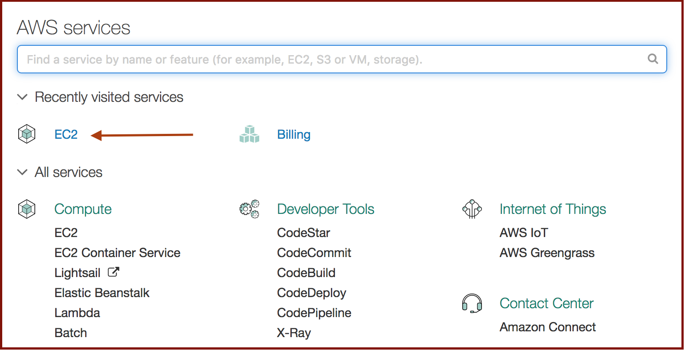
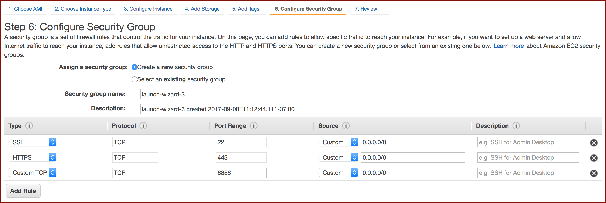

# Basic AWS EC2
A tutorial for setting up an AWS EC2 instance, installing libraries and training a simple neural network.


**Frontmatter:** 
  1. Connect to a private network. AWS will not let you secure shell to a virtual machine instance over Starbucks Wi-Fi.
  2. Clone this repo to your local machine.
  3. Install AWS Command Line Interface: http://docs.aws.amazon.com/cli/latest/userguide/installing.html
     If you have `pip` and Python, it's as simple as `$ pip install awscli --upgrade --user`

Let's begin!

# Part 1 - Launch an connect to EC2 Instance with Deep Learning AMI

### 1. Create and login to a free account at https://aws.amazon.com/
### 2. From the console, click 'EC2'



### 3. From the EC2 dashboard, launch an instance.


### 4. Choose an AMI (Amazon Machine Image).
We will use Deep Learning AMI, which comes preinstalled with Jupyter and machine learning libraries such as Theano and TensorFlow.


### 5. Choose the general purpose t2.micro instance type that is selected by default
For the purpose of this tutorial, t2.micro is sufficient and is also free for the amount we will use it. However, this is where you could scroll down and select a GPU instance if you planned to train a deep neural network on image classification, for example. Click 'Next' on this and the next several screens until you land at **Configure Security Group**.


### 6. Configure security group.
In addition to the default SSH rule, add HTTPS and Custom TCP rules shown as below. These will allow us to access the Jupyter server from our browser via HTTPS. Note that by setting the source IP to 0.0.0.0/0 for each rule, we are allowing all IP addresses to access the VM instance. If we were working on a sensitive project we wanted to secure better, we would specify just one or perhaps a range of IP addresses that could access the instance. Click **Review & Launch**.



### 7. Launch instance
Hit 'Launch'. Follow the prompt to create and download a key pair that will allow you to connect securely to your instance. Save the key pair to the **Basic_AWS_EC2** folder containing the cloned repo. From the command line, change the permissions for the key pair file by entering
```
chmod 400 key_pair.pem
```
In the below image, I've named the key pair 'tutorial,' so the downloaded key pair file will be called `tutorial.pem`.


On the Launch Status page, click 'View Instances.' You will see a lot of info about the new instance including its DNS name and public IP address, both of which we will use to access the VM.

### 8. SSH to the instance
Using your command-line tool, navigate to **Basic_AWS_EC2** where you stored key_pair.pem. Enter the following:

`ssh -i <PATH_TO_PEM> ec2-user@ec2-xx-xxx-xx-xxx.us-west-2.compute.amazonaws.com`

Because the current directory contains the key pair, `<PATH_TO_PEM>` is simply the key pair file name. Replace `ec2-xx-xxx-xx-xxx` with the Public DNS (IPv4) for your instance found on the Instances dashboard.

### 9. Install additional libraries on your EC2.
Since we chose Amazon's Deep Learning AMI, we already have the libraries we need for this tutorial. However, if you had chosen a 'vanilla' AMI that is not specialized for any task, you could set up your environment easily using `pip install` to add packages.

# Part 2 - Configure Jupyter Server

### 1. Generate Jupyter configuration file and choose password to access notebooks
Enter the following commands and follow prompt to set a password:

```
jupyter notebook --generate-config
key=$(python -c "from notebook.auth import passwd; print(passwd())")
```

### 2. Generate certificates from your chosen password
Enter the below commands and follow prompts. If you like, you may leave all fields blank when asked for info to be incorporated into the certificate request (Country Name, State or Province Name, etc.)

```
cd ~
mkdir certs
cd certs
certdir=$(pwd)
openssl req -x509 -nodes -days 365 -newkey rsa:1024 -keyout mycert.key -out mycert.pem
```

### 3. Point Jupyter configuration file at your newly created certificates
This command edits your Jupyter configuration file so that Jupyter server will grant access to notebooks over HTTPS when your password is provided:
```
cd ~
sed -i "1 a\
c = get_config()\\
c.NotebookApp.certfile = u'$certdir/mycert.pem'\\
c.NotebookApp.keyfile = u'$certdir/mycert.key'\\
c.NotebookApp.ip = '*'\\
c.NotebookApp.open_browser = False\\
c.NotebookApp.password = u'$key'\\
c.NotebookApp.port = 8888" .jupyter/jupyter_notebook_config.py
```
# Part 3 - Run Jupyter server and copy notebook to it from cloned repo
On the EC2 instance we'll create a folder `notebook` and start the Jupyter server from that location. On the EC2 instance, start Jupyter server with the same command you use on your local machine.

```
mkdir notebook
cd notebook
jupyter notebook
```
You can now access the Jupyter server in your browser at this URL:

```
https://<your-instance-public-ip>:8888
```
Open a new terminal window on your local machine and navigate to **Basic_AWS_EC2**. Enter the following command to securely copy the ipynb notebook in that folder to the EC2 instance:

```
scp -i <PATH_TO_PEM> AWS_NN_tutorial.ipynb ec2-user@ec2-xx-xxx-xx-xxx.us-west-2.compute.amazonaws.com:./notebook
```
You should now be able to run the copied notebook in your browser and proceed with the neural network demo using Theano!
