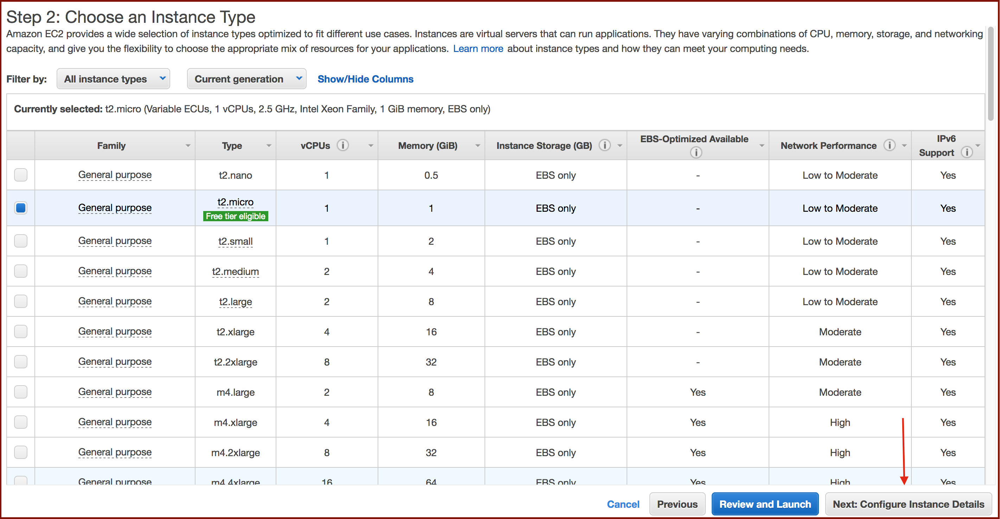

# Basic AWS EC2
A tutorial for setting up an AWS EC2 instance, installing libraries and training a simple neural network.

### 1. Create and login to a free account at https://aws.amazon.com/
### 2. From the console, click 'EC2'

### 3. From the EC2 dashboard, launch an instance.

### 4. Choose an AMI (Amazon Machine Image).
We will use Deep Learning AMI, which comes preinstalled with Jupyter and machine learning libraries such as Theano and TensorFlow.

### 5. Choose the general purpose t2.micro instance type that is selected by default
For the purpose of this tutorial, t2.micro is sufficient and is also free for the amount we will use it. However, this is where you could scroll down and select GPU instances if you planned to do some heavier lifting and train a deep neural network for image classification, for example. Click 'Next' on this and the next several screens until you land at **Configure Security Group**.

